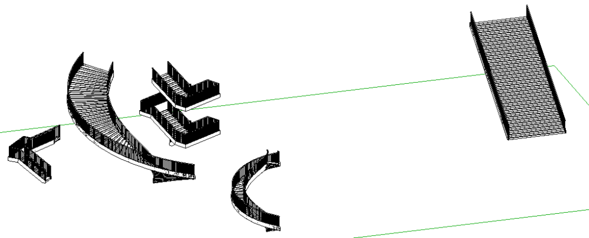

# StairsAutomation

C# .NET Revit 2019.1 SDK StairsAutomation sample.

1. [Remove warning messages for full on-line automation](#1)
&ndash; Detailed [blog post on swallowing StairsAutomation warnings](http://thebuildingcoder.typepad.com/blog/2018/09/swallowing-stairsautomation-warnings.html)
2. [Remove user interface references and automatically run](#2)
&ndash; Detailed [blog post on auto-run an add-in for design automation](http://thebuildingcoder.typepad.com/blog/2018/09/auto-run-an-add-in-for-design-automation.html)

##  Step 1. Remove Warning Messages for Full On-Line Automation

- Stair #3 generates [8 warnings about overlapping handrail model line elements](warning_messages/StairsAutomation_warnings_stair_3_8.html).
- Stair #4 generates [1 warning about a missing riser](warning_messages/StairsAutomation_warnings_stair_4_1.html).

Happily, Revit warnings can easily be handled automatically making use of
the [Failure API](http://thebuildingcoder.typepad.com/blog/about-the-author.html#5.32).

Specifically, we presented
a [generic warning swallower](http://thebuildingcoder.typepad.com/blog/2016/09/warning-swallower-and-roomedit3d-viewer-extension.html#2) that
can handle just about any warning message that crops up.

For the StairsAutomation sample, nothing much is required.

The code generating the stairs obviously runs inside a `Transaction`, and that, in turn, is enclosed in a `StairsEditScope`.

The call to `Commit` the stair editing scope is called with a custom failures preprocessor instance:

<pre class="code">
&nbsp;&nbsp;editScope.Commit(&nbsp;
&nbsp;&nbsp;&nbsp;&nbsp;new&nbsp;StairsEditScopeFailuresPreprocessor()&nbsp;);
</pre>

In the original sample, the failures preprocessor does next to nothing:

<pre class="code">
class&nbsp;StairsEditScopeFailuresPreprocessor&nbsp;
&nbsp;&nbsp;:&nbsp;IFailuresPreprocessor
{
&nbsp;&nbsp;public&nbsp;FailureProcessingResult&nbsp;PreprocessFailures(&nbsp;
&nbsp;&nbsp;&nbsp;&nbsp;FailuresAccessor&nbsp;a&nbsp;)
&nbsp;&nbsp;{
&nbsp;&nbsp;&nbsp;&nbsp;return&nbsp;FailureProcessingResult.Continue;
&nbsp;&nbsp;}
}
</pre>

I simply added the following lines of code to it, to delete all warnings before returning:
  
<pre class="code">
&nbsp;&nbsp;IList&lt;FailureMessageAccessor&gt;&nbsp;failures
&nbsp;&nbsp;=&nbsp;a.GetFailureMessages();
 
&nbsp;&nbsp;foreach(&nbsp;FailureMessageAccessor&nbsp;f&nbsp;in&nbsp;failures&nbsp;)
&nbsp;&nbsp;{
&nbsp;&nbsp;&nbsp;&nbsp;FailureSeverity&nbsp;fseverity&nbsp;=&nbsp;a.GetSeverity();
 
&nbsp;&nbsp;&nbsp;&nbsp;if(&nbsp;fseverity&nbsp;==&nbsp;FailureSeverity.Warning&nbsp;)
&nbsp;&nbsp;&nbsp;&nbsp;{
&nbsp;&nbsp;&nbsp;&nbsp;&nbsp;&nbsp;a.DeleteWarning(&nbsp;f&nbsp;);
&nbsp;&nbsp;&nbsp;&nbsp;}
&nbsp;&nbsp;}
</pre>

Now, all five stair variations are created without any warning messages being displayed.

For more deails, please refer to [The Building Coder](http://thebuildingcoder.typepad.com) discussion
on [swallowing StairsAutomation warnings](http://thebuildingcoder.typepad.com/blog/2018/09/swallowing-stairsautomation-warnings.html).

##  Step 2. Remove User Interface References and Automatically Run Add-In

- Remove all references to `RevitAPIUI.dll`
- Replace the external command derived from `IExternalCommand` by an external DB application derived from `IExternalDBApplication`
- Run automatically, e.g., hooking into `ApplicationInitialized`
- Open model file

For more deails, please refer to [The Building Coder](http://thebuildingcoder.typepad.com) discussion
on [auto-running an add-in for design automation](http://thebuildingcoder.typepad.com/blog/2018/09/auto-run-an-add-in-for-design-automation.html).

## Author

Jeremy Tammik,
[The Building Coder](http://thebuildingcoder.typepad.com),
[Forge](http://forge.autodesk.com) [Platform](https://developer.autodesk.com) [Development](https://autodesk-forge.github.io),
[ADN](http://www.autodesk.com/adn)
[Open](http://www.autodesk.com/adnopen),
[Autodesk Inc.](http://www.autodesk.com)
modified the original SDK sample.

## License

This sample is licensed under the terms of the [MIT License](http://opensource.org/licenses/MIT).
Please see the [LICENSE](LICENSE) file for full details.

